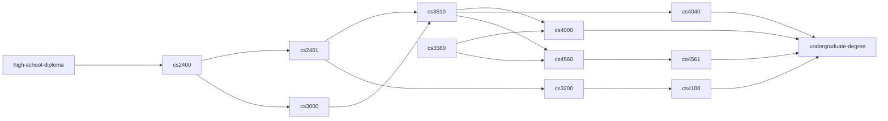

# Computer Science Curriculum (Simplified)

The following dependency graph below is a simplified version of
the prerequisite chart of the Bachelor of Science in Computer Science degree at Ohio University.



When node `A` is pointed to node `B`, node `B` is said to depends on node `A`. For example, from the
simplified version of the prerequisite chart above, `cs2401` depends on `cs2400`, and `cs2400` depends
on `high-school-diploma`.

You are to modify the given `Makefile` to mimic this simplified version of the prerequisite chart above. A target must exist for each node in the graph above. When a target is invoked, a file of the same name
should be created. Any file that is required must also be created but not from a command in this target's recipe block. The target `undergraduate-degree` must be the default target.

## Example Output 1

```console
$ ls -1
Makefile
$ make cs2401
$ ls -1
cs2400
cs2401
high-school-diploma
Makefile
```

From the output, first the command `ls -1` shows that only `Makefile` exist in the current working directory. After the `make cs2401` is run, the `ls -1` now shows that three more files have been created.
Two of these files are required for `cs2401` and one is the `cs2401` itself.

## Example Output 2

```console
$ ls -1
Makefile
$ make undergraduate-degree
$ ls -1
cs2400
cs2401
cs3000
cs3200
cs3560
cs3610
cs4000
cs4040
cs4100
cs4560
cs4561
high-school-diploma
Makefile
undergraduate-degree
```

In this example input and output, `make undergraduate-degree` is called, and all files are created for their
corresponding nodes.
