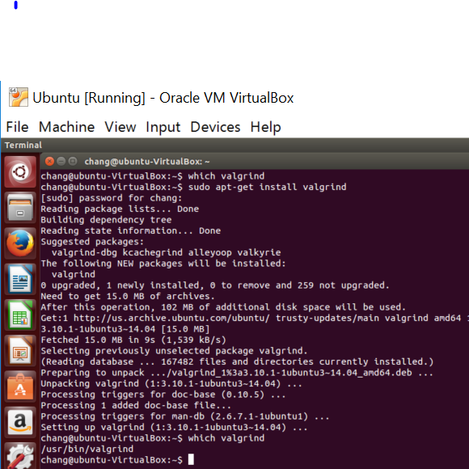
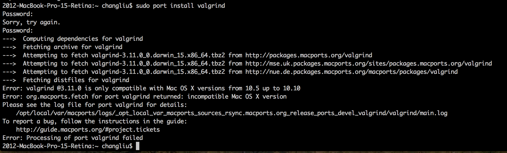

[](https://classroom.github.com/open-in-codespaces?assignment_repo_id=19260150)
<h2 align="center">
CS3560 Homework Assignment - Valgrind<br/>
Due date and points: check Canvas
</h2>

The purpose of this assignment is to gain understanding of the valgrind's output (specifically its memcheck tool)
and to gain hands-on experience on using Valgrind to analyze program.

### Step 1 - Install Valgrind

For this part you will need to install a program named [Valgrind](https://valgrind.org/). The
operating system that this program has the best support is Linux. You may try to install valgrind
on macOS, but keep in mind that the TAs can only provide limited support since they do not have
macOS devices.

Apart from setting up your own Linux machine, you can use GitHub Codespaces or Linux machines
of EECS department (`oddNN.cs.ohio.edu` machines where `NN` is odd integer).

### Step 2 - Using Valgrind to perform dynamic analysis

For each of the following program `program1.cpp`, `program2.cpp` and `program3.cpp` perform
the following steps

1. Compile the source code.
2. Analyze each of the programs using Valgrind.
3. Report the problems found by Valgrind (include this in the report).
4. Modify the code so that all problems are fixed.
5. Make a commit of your fixes, and push it out to GitHub.

### Step 3 - Checking other tools

Use Valgrind to check **two** programs/utilities that you frequently use (e.g. tools in this class: flint++, cppcheck, doxygen, git, wget, curl, ssh, etc.). Engage the programs/utilities in meaningful, non-trivial sessions. Capture Valgrind output and explain what it means. Most importantly, did Valgrind catch any problems of the production-quality tools that you use?

### Step 4 - Prepre a report

Write a report that answers the following questions.

1. For each of the three programs in step 2 what are the problems? Briefly describe the problem and the fixes you applied. Use screenshots of Valgrind's output to support your findings.
2. What tools did you selected for step 3? What non-trivial actions did you perform while running the program under Valgrind?
3. For each tool in step 3, what are the result from Valgrind? Are there any error reported by the memcheck tool?
4. Briefly compare and contrast the different between static analysis tools, dynamic analysis tools and a debugger. For each tool, which situation is suitable for it? What are similarities between them? What are the differences between them?

## Submission

1. Make a commit of your fixes in step 2 (if not already done).
1. Add the report to this repository (aka make a commit with the file).
2. Push all your commits to GitHub
3. Submit your repository URL to Canvas.

## Appendix A - Tips

### Flags

Compiling with optimization flags such as `-O2` sometimes causes certain potential issues to be hidden from Valgrind.

## Appendix B - Valgrind on various OSes

### Valgrind on Windows

One method is to install Valgrind on Unbuntu in a VirtualBox's VM on Windows. The Microsoft Windows 10 Store Ubuntu app should also work (only for CLI tools, it will not work if you want to check a browser).



### Valgrind on MacOS

As of October 2015, Valgrind MacPorts is not compatible with the latest version of Mac OS X 10.11 El Capitan. 

For Apple Silicon (M1, M2, etc.), Valgrind does not have support.

You could try to get Valgrind installed on macos, but TA currently have no way
of supporting you since they do not have Apple device (one with recent enough kernel or
one with the new Apple Silicon).

#### Old instructions for MacOS

Installing Valgrind on MacOS from the source:

```console
$ ./configure
$ make install
$ valgrind
```

Installing using Mac Port



Installing using Homebrew

```console
$ brew tap LouisBrunner/valgrind
$ brew install --HEAD LouisBrunner/valgrind/valgrind
```

More information can be found on https://github.com/LouisBrunner/valgrind-macos

Example session of valgrind on MacOS.

```console
2012-MacBook-Pro-15-Retina:Desktop changliu$ cd valgrind/ 
2012-MacBook-Pro-15-Retina:valgrind changliu$ gcc a.c 
2012-MacBook-Pro-15-Retina:valgrind changliu$ a.out 
-bash: a.out: command not found 
2012-MacBook-Pro-15-Retina:Desktop changliu$ ./a.out 
2012-MacBook-Pro-15-Retina:valgrind changliu$ ls 
a.c   a.out 
2012-MacBook-Pro-15-Retina:valgrind changliu$ cat a.c 
  #include <stdlib.h> 

  void f(void) 
  { 
     int* x = malloc(10 * sizeof(int)); 
     x[10] = 0;        // problem 1: heap block overrun 
  }                    // problem 2: memory leak -- x not freed 

  int main(void) 
  { 
     f(); 
     return 0; 
  } 
2012-MacBook-Pro-15-Retina:valgrind changliu$ valgrind --leak-check-yes a.out 
valgrind: a.out: command not found 
2012-MacBook-Pro-15-Retina:valgrind changliu$ valgrind --leak-check-yes ./a.out 
valgrind: Unknown option: --leak-check-yes 
valgrind: Use --help for more information or consult the user manual. 
2012-MacBook-Pro-15-Retina:valgrind changliu$ valgrind --leak-check=yes ./a.out 
==45338== Memcheck, a memory error detector 
==45338== Copyright (C) 2002-2015, and GNU GPL'd, by Julian Seward et al. 
==45338== Using Valgrind-3.11.0 and LibVEX; rerun with -h for copyright info 
==45338== Command: ./a.out 
==45338==  
--45338-- run: /usr/bin/dsymutil "./a.out" 
warning: no debug symbols in executable (-arch x86_64) 
==45338== Invalid write of size 4 
==45338==    at 0x100000F4C: f (in ./a.out) 
==45338==    by 0x100000F73: main (in ./a.out) 
==45338==  Address 0x100a7e178 is 0 bytes after a block of size 40 alloc'd 
==45338==    at 0x100007EA1: malloc (vg_replace_malloc.c:303) 
==45338==    by 0x100000F43: f (in ./a.out) 
==45338==    by 0x100000F73: main (in ./a.out) 
==45338==  
==45338==  
==45338== HEAP SUMMARY: 
==45338==     in use at exit: 22,200 bytes in 182 blocks 
==45338==   total heap usage: 258 allocs, 76 frees, 28,296 bytes allocated 
==45338==  
==45338== 40 bytes in 1 blocks are definitely lost in loss record 20 of 60 
==45338==    at 0x100007EA1: malloc (vg_replace_malloc.c:303) 
==45338==    by 0x100000F43: f (in ./a.out) 
==45338==    by 0x100000F73: main (in ./a.out) 
==45338==  
==45338== LEAK SUMMARY: 
==45338==    definitely lost: 40 bytes in 1 blocks 
==45338==    indirectly lost: 0 bytes in 0 blocks 
==45338==      possibly lost: 0 bytes in 0 blocks 
==45338==    still reachable: 0 bytes in 0 blocks 
==45338==         suppressed: 22,160 bytes in 181 blocks 
==45338==  
==45338== For counts of detected and suppressed errors, rerun with: -v 
==45338== ERROR SUMMARY: 2 errors from 2 contexts (suppressed: 16 from 16) 
2012-MacBook-Pro-15-Retina:valgrind changliu$  
2012-MacBook-Pro-15-Retina:valgrind changliu$ gcc -g a.c 
2012-MacBook-Pro-15-Retina:valgrind changliu$ valgrind --leak-check=full ./a.out 
==55015== Memcheck, a memory error detector 
==55015== Copyright (C) 2002-2015, and GNU GPL'd, by Julian Seward et al. 
==55015== Using Valgrind-3.11.0 and LibVEX; rerun with -h for copyright info 
==55015== Command: ./a.out 
==55015==  
==55015== Invalid write of size 4 
==55015==    at 0x100000F4C: f (a.c:6) 
==55015==    by 0x100000F73: main (a.c:11) 
==55015==  Address 0x100a7e178 is 0 bytes after a block of size 40 alloc'd 
==55015==    at 0x100007EA1: malloc (vg_replace_malloc.c:303) 
==55015==    by 0x100000F43: f (a.c:5) 
==55015==    by 0x100000F73: main (a.c:11) 
==55015==  
==55015==  
==55015== HEAP SUMMARY: 
==55015==     in use at exit: 22,200 bytes in 182 blocks 
==55015==   total heap usage: 258 allocs, 76 frees, 28,296 bytes allocated 
==55015==  
==55015== 40 bytes in 1 blocks are definitely lost in loss record 20 of 60 
==55015==    at 0x100007EA1: malloc (vg_replace_malloc.c:303) 
==55015==    by 0x100000F43: f (a.c:5) 
==55015==    by 0x100000F73: main (a.c:11) 
==55015==  
==55015== LEAK SUMMARY: 
==55015==    definitely lost: 40 bytes in 1 blocks 
==55015==    indirectly lost: 0 bytes in 0 blocks 
==55015==      possibly lost: 0 bytes in 0 blocks 
==55015==    still reachable: 0 bytes in 0 blocks 
==55015==         suppressed: 22,160 bytes in 181 blocks 
==55015==  
==55015== For counts of detected and suppressed errors, rerun with: -v 
==55015== ERROR SUMMARY: 2 errors from 2 contexts (suppressed: 16 from 16) 
2012-MacBook-Pro-15-Retina:valgrind changliu$
```

## Appendix C - Valgrind Examples

### Example 1

```console
2012-MacBook-Pro-15-Retina:valgrind changliu$ cat c.c
#include <stdio.h>

int foo(int x)
{
    if(x < 10)
    {
        printf("x is less than 10\n");
    }
    return 0;
}

int main()
{
    int y;
foo(y);
    return 0;
}
2012-MacBook-Pro-15-Retina:valgrind changliu$ gcc -g c.c
2012-MacBook-Pro-15-Retina:valgrind changliu$ valgrind --leak-check=full ./a.out
==55187== Memcheck, a memory error detector
==55187== Copyright (C) 2002-2015, and GNU GPL'd, by Julian Seward et al.
==55187== Using Valgrind-3.11.0 and LibVEX; rerun with -h for copyright info
==55187== Command: ./a.out
==55187== 
==55187== Conditional jump or move depends on uninitialised value(s)
==55187==    at 0x100000F12: foo (c.c:5)
==55187==    by 0x100000F56: main (c.c:15)
==55187== 
==55187== 
==55187== HEAP SUMMARY:
==55187==     in use at exit: 22,160 bytes in 181 blocks
==55187==   total heap usage: 257 allocs, 76 frees, 28,256 bytes allocated
==55187== 
==55187== LEAK SUMMARY:
==55187==    definitely lost: 0 bytes in 0 blocks
==55187==    indirectly lost: 0 bytes in 0 blocks
==55187==      possibly lost: 0 bytes in 0 blocks
==55187==    still reachable: 0 bytes in 0 blocks
==55187==         suppressed: 22,160 bytes in 181 blocks
==55187== 
==55187== For counts of detected and suppressed errors, rerun with: -v
==55187== Use --track-origins=yes to see where uninitialised values come from
==55187== ERROR SUMMARY: 1 errors from 1 contexts (suppressed: 16 from 16)
2012-MacBook-Pro-15-Retina:valgrind changliu$ valgrind --track-origins=yes --leak-check=full ./a.out
==55189== Memcheck, a memory error detector
==55189== Copyright (C) 2002-2015, and GNU GPL'd, by Julian Seward et al.
==55189== Using Valgrind-3.11.0 and LibVEX; rerun with -h for copyright info
==55189== Command: ./a.out
==55189== 
==55189== Conditional jump or move depends on uninitialised value(s)
==55189==    at 0x100000F12: foo (c.c:5)
==55189==    by 0x100000F56: main (c.c:15)
==55189==  Uninitialised value was created by a stack allocation
==55189==    at 0x7FFF5FC01036: _dyld_start (in /usr/lib/dyld)
==55189== 
==55189== 
==55189== HEAP SUMMARY:
55189==   total heap usage: 257 allocs, 76 frees, 28,256 bytes allocated
==55189== 
==55189== LEAK SUMMARY:
==55189==    definitely lost: 0 bytes in 0 blocks
==55189==    indirectly lost: 0 bytes in 0 blocks
==55189==      possibly lost: 0 bytes in 0 blocks
==55189==    still reachable: 0 bytes in 0 blocks
==55189==         suppressed: 22,160 bytes in 181 blocks
==55189== 
==55189== For counts of detected and suppressed errors, rerun with: -v
==55189== ERROR SUMMARY: 1 errors from 1 contexts (suppressed: 16 from 16)
2012-MacBook-Pro-15-Retina:valgrind changliu$ 
```

From the above output, one of the problem found is

```plain
...
==55187== Conditional jump or move depends on uninitialised value(s)
==55187==    at 0x100000F12: foo (c.c:5)
==55187==    by 0x100000F56: main (c.c:15)
...
```

## Appendix D - Rubric

#### 100% (The total number of points is posted on Canvas)

- Students demonstrate that they are able to use Valgrind to detect problem in a program.
- Students show that they be able to fix common problems detected by valgrind.
- Students are able to describe the similarities and the differences between static analysis tools, dynamic analysis tools and a debugger.

#### 90%

- Students fail to meet one of the requirements in the 100% category.

#### 80%

- Students fail to meet two of the requirements in the 100% category.

#### 0%

- No work.
