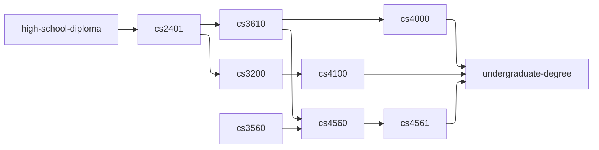

# Computer Science Curriculum (Simplified)

The following dependency graph below is a simplified version of
the prerequisite chart of the Bachelor of Science in Computer Science degree at [Ohio University](https://www.ohio.edu/).



(You may want to view this README.md file on GitHub for the graph to get rendered.)

Here is an example of how to interpret the graph. When node `A` is pointed to node `B`, node `B` is said to depends on node `A`. For example, from the
simplified version of the prerequisite chart above, `cs3610` depends on `cs2401`. Similarly, `cs2401` depends
on `high-school-diploma`.

You are to modify the given Makefile to mimic this simplified version of the prerequisite chart above. A target must exist for each node in the graph above. When a target is invoked, a file of the same name
should be created. Any file that is required must also be created but not from a command in this target's recipe block. The target `undergraduate-degree` must be the default target.

## Example Output 1

```console
$ ls -1
Makefile
$ make cs2401
$ ls -1
cs2401
high-school-diploma
Makefile
```

From the output, first the command, `ls -1`, shows that only `Makefile` exist in the current working directory. After the `make cs2401` is run, the `ls -1` now shows that two more files have been created.
One of these files are the dependency for `cs2401` and another one  is the `cs2401` itself.

## Example Output 2

```console
$ ls -1
Makefile
$ make undergraduate-degree
$ ls -1
cs2401
cs3200
cs3560
cs3610
cs4000
cs4100
cs4560
cs4561
high-school-diploma
Makefile
undergraduate-degree
```

In this example input and output, `make undergraduate-degree` is called, and all files are created for their
corresponding nodes.

## Known Issues

- The grading script will not check if the undergraduate-degree is the default target or not.
