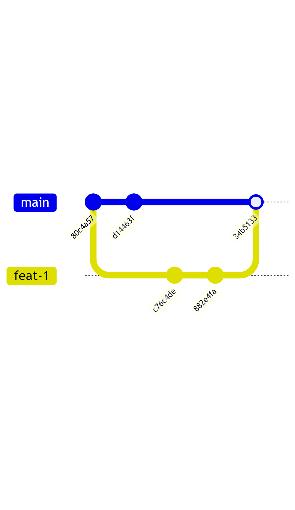

# making-commits

In `answer.sh`, write all commands necessary to create a repository with the following commit history tree.
The commit id (the 40 digits hash value) can be different and we will only check if the structure is the same or not. When `answer.sh` is run, it must not need human's input. It must successfully re-create the commit
history tree without any error (e.g. a merge conflict error.)

```plain
*   34b5133 (HEAD -> main) Merge branch 'feat-1'
|\  
| * 882e4fa (feat-1) h
| * c76c4de f
* | d14463f g
|/  
* 80c4a57 e
```

Alternate visualizations of these commit history trees can be viewed in Appendix A.

## Submission

1. Create a gzipped tar file of `repo` folder and name it `repo.tar.gz`.
2. Commit `answer.sh` and `repo.tar.gz` into this repository.

## Tips

- Please be careful not to make a commit in this repository.
- There are **four** commits on two branches (`main` and `feat-1`). Each branch has two commits each.
- There is **one** merge commit that merges `feat-1` into the `main` branch.
- You can use command like `echo` or `touch` to create new file needed for creating a commit.
- On each commit, use/modify file with different name to avoid a merge conflict.

## Appendix A - Image of the Commit History Tree




## Appendix B - Grading script behavior

It will create a temporary folder and initialize a git repository with `main` as the default branch before running the answer script in this repository.
